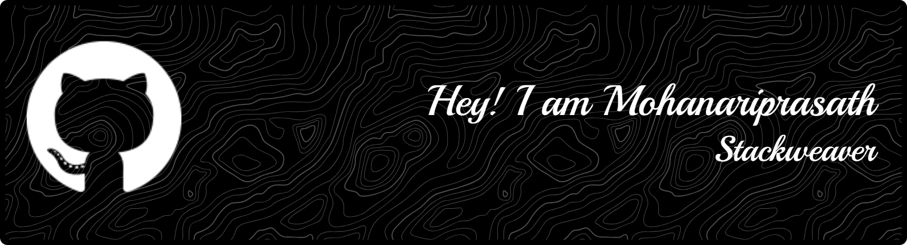

  
  
   
  
  
  
  

<h1>About me</h1>

I’m an aspiring Full-Stack Developer with a strong passion for building scalable and user-focused web applications.
Alongside development, I’m also interested in Product Design, where I focus on creating intuitive interfaces and meaningful user experiences.

Currently, I’m sharpening my skills in the MERN Stack (MongoDB, Express, React, Node.js) and exploring design principles using tools like Figma to bridge the gap between functionality and aesthetics.
My goal is to grow into a well-rounded engineer who can design, build, and deliver impactful digital products.

### What I’m Currently Focusing On  

  
  
  
  

  

 
 
 

<h2>My Projects</h2>

Built an AI-assisted cross-platform finance tracker using Flutter, SQLite, and Provider, featuring smart transaction/category predictions, budgets, CSV export, interactive analytics, and a clean, optimized architecture (<100ms queries) that reduced manual entry by ~90% and is scalable for cloud sync or ML upgrades.

Developed a deep-learning MRI brain tumor classifier (Glioma, Meningioma, Pituitary, No Tumor) using TensorFlow/Keras with advanced preprocessing, augmentation, Grad-CAM explainability, and optimized CNN inference (<0.1s) achieving 85–92% accuracy.

<h2> My Contribution Graph and Status</h2>

  
  

  

<h2>Technical Skills</h2>

  
  
  
  
  
  
  
  
  
  
  
  
  
  
  
  
  
  
  
  
  
  

<h2>Professional Skills</h2>

  

    <strong style="color:#9ad0ff;margin-right:6px;">➤</strong> Teamwork &amp; Collaboration
  

  

    <strong style="color:#9ad0ff;margin-right:6px;">➤</strong> Professionalism
  

  

    <strong style="color:#9ad0ff;margin-right:6px;">➤</strong> Decision Making
  

  

    <strong style="color:#9ad0ff;margin-right:6px;">➤</strong> Adaptability
  

  

    <strong style="color:#9ad0ff;margin-right:6px;">➤</strong> Work Ethic &amp; Discipline
  

