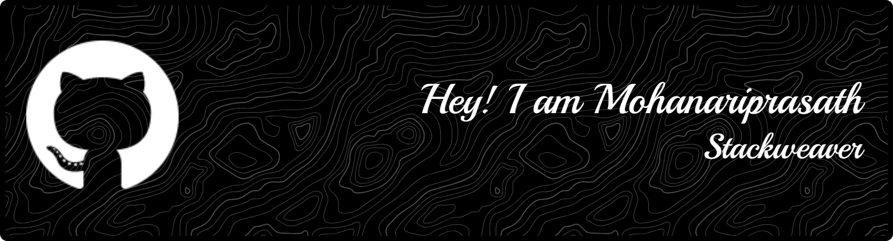

  
 

  
  
  

I’m an aspiring Full-Stack Developer with a strong passion for building scalable and user-focused web applications.
Alongside development, I’m also interested in Product Design, where I focus on creating intuitive interfaces and meaningful user experiences.

Currently, I’m sharpening my skills in the MERN Stack (MongoDB, Express, React, Node.js) and exploring design principles using tools like Figma to bridge the gap between functionality and aesthetics.
My goal is to grow into a well-rounded engineer who can design, build, and deliver impactful digital products.

### What I’m Currently Focusing On  

  
  
  
  

  

 
 
 

### 🧩 My GitHub Contribution Graph

  

### My Approach

  Coding is not about who you are — it’s about what you can create.

 

 
